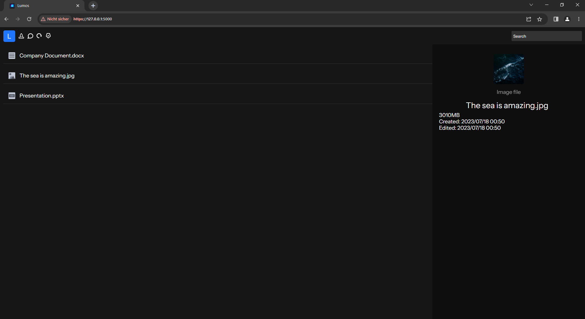

# 
# Self host your own cloud

## How does it work

    

Lumos is a self-hostable Python Flask application you can run on Windows or Linux servers.

It has an easy web shell & file manager for the admin and for your teammates or family members.

Lumos also offers a small chat solution embedded in the file manager.

Its light web interface and small design make it simple to manage files and keep a fast workflow.

It also gives you the opportunity to protect your files using robust symmetric encryption out of the box.

- 🕒 Fast
- 🔒 Secure
- 👾 Virus Scanner
- 💬 Chat
- 🖥 Web Interface
- 📎 Liml sharing for files
- 🤓 Easy

### Screenshots

    
    
    

### Prequisites

Lumos uses Python to work. On Linux, it is installed by default. If you want to use it on Windows, you'll need to download Python from the [official website](https://www.python.org/).

### The setup

After you downloaded the code from the repository, run the following command or install the following packages using pip on your computer.

`pip3 install pyAesCrypt flask Pillow psutil` *This installs pyAesCrypt for encryption, Flask as the web server with werkzeug and Pillow for image manipulation, and PSutil for system information like CPU and RAM usage.*

When everything is done run the python file `__main__.py` by running `python3 ./__main__.py` in the Lumos folder.

After few seconds, you'll be able to access the address `0.0.0.0:4999` (Linux) or `127.0.0.1:4999` in your web browser.

Now you can follow the instructions on the website.

### After the setup

You can now give the ACCID code you set in the process to your family members or teammates.

They can create their own account on your cloud. Therefore, you need to give them the IP address of your
server, too. It might look like: `192.168.1.83:5000`.

After that, your members can log in and upload files, and you are done.

### Legal information

Lumos is released under the Apache 2.0 license. Please be honest and don't violate its conditions, 
but feel free to fork it or edit it for your purposes.

More information at [legal.md](legal.md)I